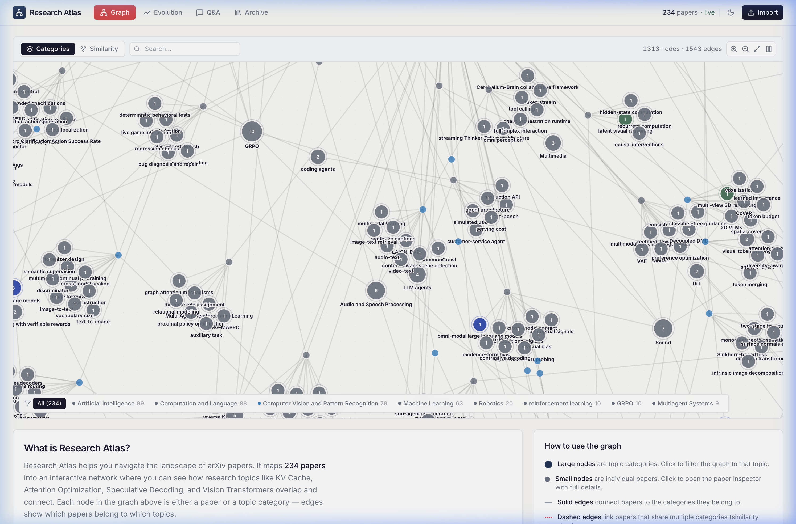
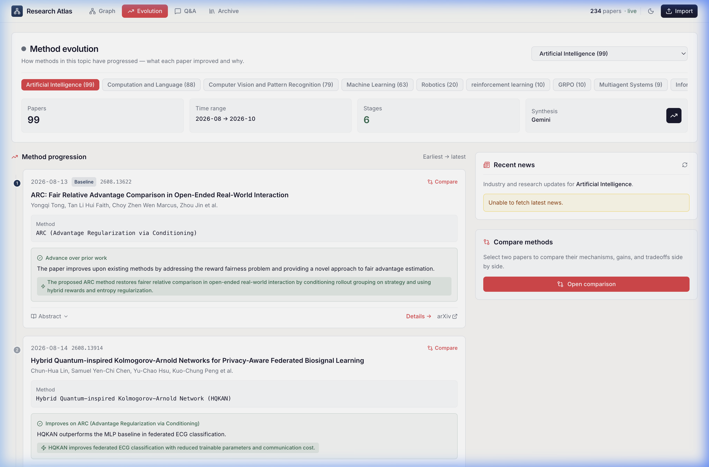
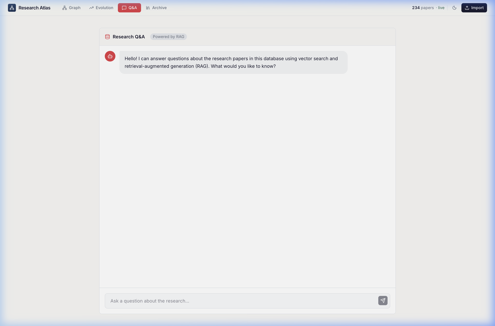
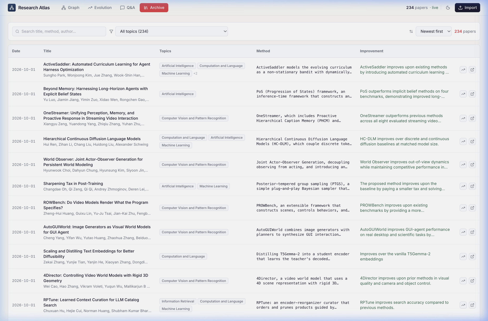
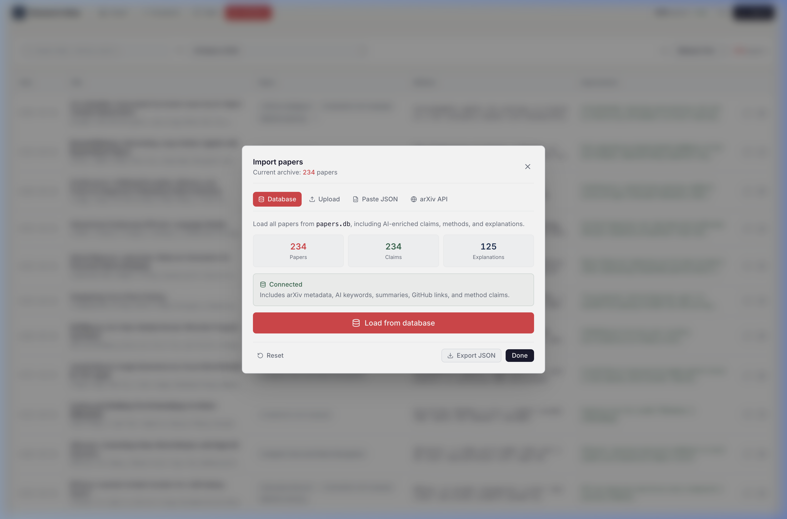

<div align="center">

# 🔬 Research Atlas

**Interactive knowledge graph & topic evolution tracker for arXiv papers**

Map research landscapes, trace how methods evolve over time, and ask questions about your paper collection — powered by AI.

[](https://vercel.com/new/clone?repository-url=https%3A%2F%2Fgithub.com%2FYOUR_USERNAME%2Fresearch-atlas)
[](LICENSE)

<br/>



</div>

---

## ✨ Features

### 🕸️ Interactive Paper Network Graph
Explore your research corpus as a force-directed knowledge graph. Papers and topic categories form an interconnected network — click any node to inspect papers, filter by topic, or switch between **bipartite** (paper ↔ category) and **similarity** (paper ↔ paper) views.

### 📈 Topic Evolution Timeline
Select any research topic (e.g., *KV Cache*, *Speculative Decoding*, *Vision Transformers*) and trace its chronological development. See which papers introduced which methods, and use **AI-powered synthesis** to generate a rigorous comparative analysis of how Method X evolved into Method Y.



### 💬 Research Q&A
Ask natural language questions about your paper collection. The system finds the most relevant papers using keyword matching and uses **Gemini AI** to synthesize an answer with proper citations.



### 📚 Searchable Paper Archive
A filterable, sortable table of every paper in your collection — search by title, author, category, or method. Click any row to open the full paper inspector.



### 📥 Flexible Import
Bring your own papers — import from a local SQLite database, paste JSON, or **fetch live from arXiv** using any search query.



### 🌗 More
- **Dark / Light mode** with system preference detection
- **Responsive** — works on desktop, tablet, and mobile
- **Live arXiv fetch** — pull the latest papers directly from arXiv's API
- **Topic news feed** — see the latest industry developments for any topic
- **Gemini AI categorization** — auto-categorize any paper from its abstract
- **Offline-capable** — papers are cached in localStorage

---

## 🚀 Quick Start

### Option 1: Deploy to Vercel (Recommended — Free)

1. Fork this repo
2. Go to [vercel.com](https://vercel.com) → **Add New Project** → Import your fork
3. Add environment variable: `GEMINI_API_KEY` = [your free Gemini key](https://aistudio.google.com/apikey)
4. Deploy — done! 🎉

### Option 2: Run Locally

```bash
git clone https://github.com/YOUR_USERNAME/research-atlas.git
cd research-atlas
npm install
npm run dev
```

The app starts at `http://localhost:3001`. Paper data loads from `public/data/papers.json`.

---

## 🔧 Configuration

### Environment Variables

| Variable | Required | Description |
|---|---|---|
| `GEMINI_API_KEY` | For AI features | Free at [aistudio.google.com/apikey](https://aistudio.google.com/apikey) |
| `NEWSDATA_API_KEY` | Optional | For topic news feed ([newsdata.io](https://newsdata.io)) |

### Local Development with SQLite (Advanced)

If you have a local papers database, you can run the full Express backend:

```bash
# Set in .env
DB_PATH=/path/to/papers.db
USE_OLLAMA=true          # Optional: use local Ollama instead of Gemini
OLLAMA_MODEL=llama3.1

# Run the Express server (serves API + Vite frontend)
npm run dev
```

### Updating Paper Data

Export your SQLite database to static JSON for deployment:

```bash
python3 scripts/export-db-to-json.py /path/to/papers.db
git add public/data/
git commit -m "Update paper data"
git push  # Vercel auto-deploys
```

---

## 🏗️ Tech Stack

| Layer | Technology |
|---|---|
| Frontend | React 19, TypeScript, Tailwind CSS 4, Framer Motion |
| Visualization | D3.js force-directed graph |
| AI | Google Gemini API (free tier) |
| Deployment | Vercel (static + serverless functions) |
| Local Backend | Express, better-sqlite3, Ollama (optional) |

---

## 📁 Project Structure

```
research-atlas/
├── api/                          # Vercel Serverless Functions
│   ├── analyze-topic.js          # AI topic evolution analysis
│   ├── categorize-paper.js       # AI paper categorization
│   ├── rag-qa.js                 # Research Q&A with citations
│   └── topic-news.js             # News feed proxy
├── public/data/                  # Static paper data (from SQLite export)
│   ├── papers.json
│   ├── categories.json
│   └── db-stats.json
├── src/
│   ├── components/
│   │   ├── NetworkGraph.tsx      # D3 force-directed knowledge graph
│   │   ├── TopicDevelopments.tsx  # Topic evolution timeline + AI synthesis
│   │   ├── RagQA.tsx             # Research Q&A chat interface
│   │   ├── PaperTable.tsx        # Searchable paper archive
│   │   ├── PaperDrawer.tsx       # Paper detail inspector
│   │   └── ImportModal.tsx       # Paper import (JSON, arXiv, DB)
│   ├── hooks/                    # Data fetching & theme hooks
│   ├── utils/                    # Graph layout utilities
│   └── App.tsx                   # Main app with tab navigation
├── scripts/
│   └── export-db-to-json.py      # SQLite → JSON export tool
├── server.ts                     # Express backend (local dev)
└── vercel.json                   # Vercel deployment config
```

---

## 📄 License

MIT — use it however you want.

---

<div align="center">
  <sub>Built with React, D3, and Gemini AI</sub>
</div>
